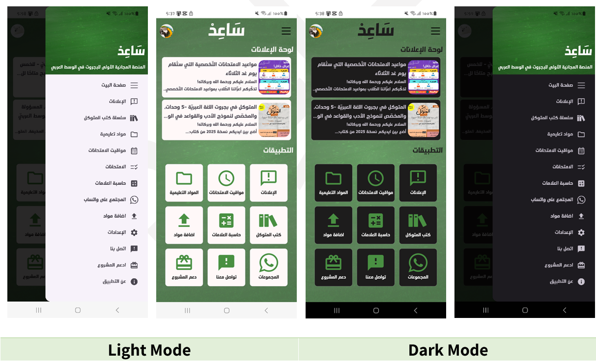
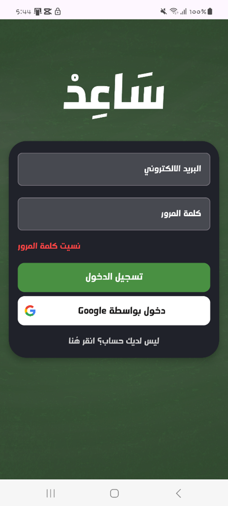
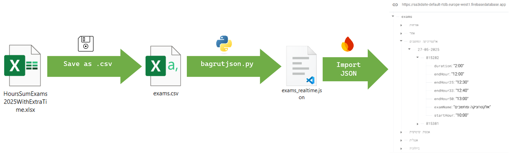

# Sa3id – High‑School Bagrut Preparation App

**Author:** Mohammed Badran  
**Platform:** Android Studio
**Backend:** Firebase (Realtime DB, Storage, Firestore, Auth)

---

## 📖 Introduction

_Sa3id_ is a comprehensive mobile platform designed for Israeli high‑school students preparing for the Bagrut exams. It bundles:

- **Exam calendar & reminders** – auto‑imported from MoE CSV → JSON pipeline  
- **Grades calculator** – real‑time tracking of final scores per subject  
- **Bagrut bank** – past exams, official solutions, quizzes  
- **Study materials** – upload/download, admin approval system  
- **Announcements & feedback** – push notifications and two‑way messaging  
- **User authentication** – email/password + Google Sign‑In

---

## ⚙️ Features

1. **User Auth**  
   - Email/password & Google OAuth  
   - Profile editing (picture & username)

2. **Bagrut Subject Selection**  
   - Mandatory subjects with unit‑level radio buttons  
   - Elective majors & “advanced mode” exam ID checklist  

3. **Exam Calendar**  
   - Firebase Realtime‐DB import of official MoE timetable  
   - Local notifications respecting extra‑time entitlement  

4. **Grades Calculator**  
   - Flexible weighting per component  
   - Instant updates & progress tracking  

5. **Materials & Exams Bank**  
   - Browse past exams & solutions  
   - Upload new resources for review  

6. **Announcements & Feedback**  
   - Admin‐driven notices  
   - In‑app feedback system  

7. **Settings & Preferences**  
   - Theme, notification toggles, extra‑time settings  

---

## 🚀 Getting Started

### Prerequisites

- Android Studio Bumblebee or later  
- Kotlin 1.6+  
- Firebase project with:  
  - Realtime Database  
  - Cloud Firestore  
  - Storage  
  - Authentication enabled  


## 🏗️ Architecture & UML

The app follows an MVVM‑inspired structure with:

* **Activities/Fragments** for UI
* **Managers** (e.g., `ExamManager`) for Firebase logic
* **Models** for data classes

### UML Class Diagram


---

## 🖼️ Screenshots


<p align="center">
  
</p>


---

## 🔧 Bagrut Exam System – מערכת ניהול בחינות בגרות

Automated **Exams → JSON → Realtime-DB** pipeline

The Ministry of Education publishes two Excel/CSV files every year that list all Bagrut examinations (subject, date, hours, extra-timetables, etc.). Instead of entering this data manually, the project contains a small Python utility that performs the entire import in one click.

**Diagram**  




### What the script does

1. **Read the official file**

   * Detects commas vs. tabs
   * Strips hidden UTF‑8 BOM so headers stay clean
2. **Identify the subject**

   * Maps the numeric exam‑ID prefix (e.g. `899` → Computer Science, `35` → Mathematics)
3. **Build a clean hierarchy**

   ```
   exams
   └─ <subject>
       └─ <date dd‑MM‑yyyy>
           └─ <exam‑id>
               • examName  
               • startHour / endHour  
               • duration  
               • endHour25 / 33 / 50 (extra‑time variants)
   ```
4. **Sort**

   * Subjects alphabetically (Hebrew)
   * Dates chronologically within each subject
5. **Export to JSON**

   * Writes to `exams_realtime.json`
6. **Upload to Firebase**

   * One-click import (or via REST API) under `/exams`

### Why this matters for the app

| App component             | How it uses the data                                                                  |
| ------------------------- | ------------------------------------------------------------------------------------- |
| **ChooseBagrutsActivity** | Lets students tick only the subjects they study; filters `/exams` accordingly         |
| **ExamsActivity**         | Shows per‑subject, date‑grouped list with correct end‑hour per extra‑time entitlement |
| **CalendarActivity**      | Merges `/exams` with personal events; tapping a date reveals that day’s exams         |

Because the JSON is structured in subject → date buckets, each screen reads exactly the nodes it needs in a single DB call, minimizing network traffic and UI latency.

### Maintenance workflow (twice a year)

1. Download the fresh Excel from the MoE portal and save as `exams.csv`.
2. Run:

   ```bash
   python exams_csv_to_json.py
   ```
3. Import the generated `exams_realtime.json` into Firebase.
4. No APK update is required; users see the new timetable on next sync.

This lightweight pipeline ensures the exam timetable is always accurate, eliminates copy‑paste errors, and takes under two minutes per release cycle.

---

## 📄 License

Distributed under the MIT License. See [LICENSE](LICENSE) for more details.


